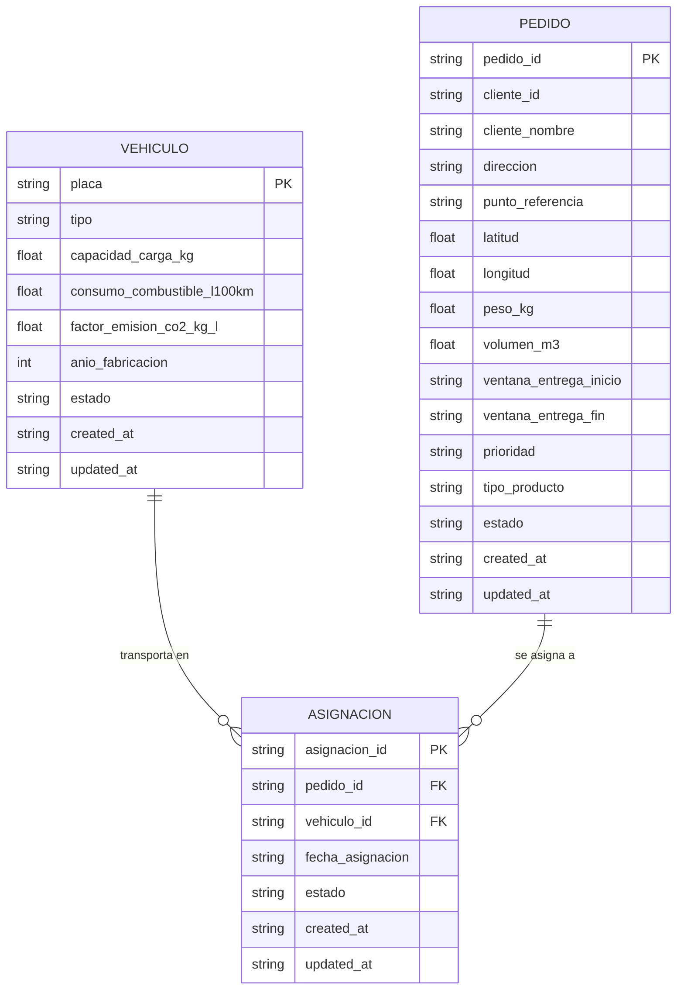
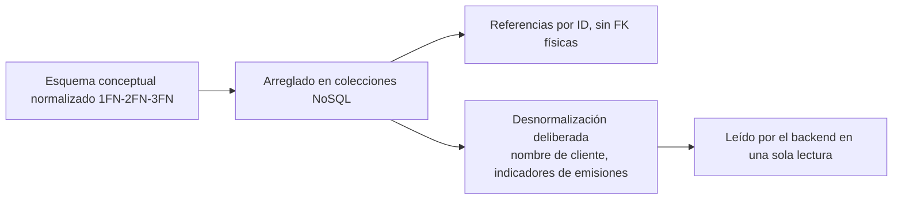

**PROYECTO FINAL DE CARRERA (PFA)**
**EcoRuta Wanka**
*Optimizador de rutas sostenibles de última milla — Huancayo, Junín*

# 11. Base de datos

**Versión:** V_1_0_0 | **Fecha:** 04 de septiembre de 2026 | **Organización:** WankaLogística S.A.C. | **Ubicación:** Huancayo, Junín, Perú | **Repositorio:** github.com/DayanaJC/EcoRuta-Wanka

---

## 1. Objeto del documento

Describe el modelo de datos **real** de EcoRuta Wanka. El sistema persiste en **Firebase Cloud Firestore** (NoSQL, documental), accedida desde el backend a través del **Firebase Admin SDK**. Este documento presenta los niveles conceptual, lógico, de normalización y físico de las colecciones implementadas en el código:

- `backend/app/data/repositories/firebase/vehiculo_repository.py` → colección **`vehiculos`**
- `backend/app/data/repositories/firebase/pedido_repository.py` → colección **`pedidos`**
- `backend/app/data/repositories/firebase/asignacion_repository.py` → colección **`asignaciones`**

> No existe colección `rutas`: la planificación de rutas es un **resultado transitorio** calculado en memoria por el servicio `RutaService` (Haversine + vecino cercano + 2-opt) y devuelto por el endpoint `POST /api/v1/rutas`, no un dato persistido.

---

## 2. Decisiones de diseño

| Tema | Decisión | Fundamento |
| --- | --- | --- |
| Motor | NoSQL documental (Cloud Firestore) | Sin servidores, escalado automático, nivel gratuito, síncrono con el stack del doc. 10 |
| Forma de acceso | Solo backend (Firebase Admin SDK) | El frontend no accede a Firestore; toda operación pasa por la API REST |
| Identificadores | IDs autogenerados por Firestore (`número-aleatorio`) | No se implementan claves numéricas secuenciales |
| Relaciones | Referencias por ID (sin Foreign Keys físicas) | Compatible con el paradigma documental |
| Transacciones | Atomicidad por documento | Las reglas de negocio (asignación, estado) se validan en el backend (doc. 09) |
| Latencia | Consultas de colecciones pequeñas del MVP | Los escaneos actuales están acotados por el volumen académico |

---

## 3. Nivel conceptual (ERD)



**Regla de cardinalidad (académica):**

- Un **vehículo** transporta **0 a N** pedidos a través de las asignaciones activas de una fecha.
- Un **pedido** es asignado a **0 o 1** vehículo en una fecha dada (una asignación activa por pedido en la operación del MVP).
- La asignación es la **entidad puente** (relaciona la flota con la demanda y habilita el cálculo de rutas).

---

## 4. Nivel lógico

### 4.1 Colección `vehiculos`

| Campo | Tipo (Firestore) | Obligatorio | Descripción |
| --- | --- | --- | --- |
| `_id` | Cadena (autogenerado) | Sí | Identificador único del vehículo |
| `placa` | Cadena | Sí | Placa única del vehículo (formato peruano, normalizada) |
| `tipo` | Cadena | Sí | Enum `TipoVehiculo`: `camioneta` / `furgon` / `moto` |
| `capacidad_carga_kg` | Número | Sí | Capacidad máxima de carga en kg |
| `consumo_combustible_l100km` | Número | Sí | Consumo referencial (l/100 km) |
| `factor_emision_co2_kg_l` | Número | Sí | Factor de emisión (kg CO₂/l) |
| `anio_fabricacion` | Número | Sí | Año de fabricación |
| `estado` | Cadena | Sí | Enum `EstadoVehiculo`: `activo` / `inactivo` |
| `created_at` / `updated_at` | Cadena (ISO 8601) | Sí | Auditoría |

**Consultas implementadas:** por ID, por `placa` (única), listado con filtro `estado`.

### 4.2 Colección `pedidos`

| Campo | Tipo (Firestore) | Obligatorio | Descripción |
| --- | --- | --- | --- |
| `_id` | Cadena (autogenerado) | Sí | Identificador único del pedido |
| `cliente_id` | Cadena | Sí | Identificador del cliente (externo) |
| `cliente_nombre` | Cadena | Sí | Nombre del cliente para la interfaz |
| `direccion` | Cadena | Sí | Dirección de entrega |
| `punto_referencia` | Cadena | No | Punto de referencia del lugar |
| `latitud` / `longitud` | Número | Sí | Coordenadas geográficas (RN-004 del doc. 09) |
| `peso_kg` | Número | Sí | Peso del pedido |
| `volumen_m3` | Número | Sí | Volumen del pedido |
| `ventana_entrega_inicio` / `ventana_entrega_fin` | Cadena (HH:MM) | Sí | Ventana horaria de entrega (RN-006) |
| `prioridad` | Cadena | Sí | Enum `PrioridadPedido`: `express` / `estandar` / `economico` |
| `tipo_producto` | Cadena | Sí | Enum `TipoProducto`: `perecedero` / `no_perecedero` |
| `estado` | Cadena | Sí | Enum `EstadoPedido`: `pendiente` / `en_ruta` / `entregado` / `cancelado` |
| `created_at` / `updated_at` | Cadena (ISO 8601) | Sí | Auditoría |

**Consultas implementadas:** por ID, listado con filtros `estado` y `prioridad` (escaneo en memoria del MVP).

### 4.3 Colección `asignaciones`

| Campo | Tipo (Firestore) | Obligatorio | Descripción |
| --- | --- | --- | --- |
| `_id` | Cadena (autogenerado) | Sí | Identificador único de la asignación |
| `pedido_id` | Cadena (referencia) | Sí | Clave foránea lógica → `pedidos._id` |
| `vehiculo_id` | Cadena (referencia) | Sí | Clave foránea lógica → `vehiculos._id` |
| `fecha_asignacion` | Cadena (ISO 8601) | Sí | Fecha del servicio |
| `estado` | Cadena | Sí | Enum `EstadoAsignacion`: `asignada` / `cancelada` |
| `created_at` / `updated_at` | Cadena (ISO 8601) | Sí | Auditoría |

**Consultas implementadas:** por ID, por `vehiculo_id`, por `pedido_id` (necesarias para validar que el pedido no esté ya asignado y para listar la ruta de un vehículo).

---

## 5. Normalización académica

Aunque Firestore es **NoSQL (documental)**, el esquema se diseñó aplicando criterios de normalización para garantizar consistencia:

| Forma | Aplicación | Evidencia |
| --- | --- | --- |
| **1NF** | Cada atributo contiene **valores atómicos** (no arreglos ni campos compuestos). | `vehiculos`, `pedidos`, `asignaciones` usan campos planos escalares |
| **2NF** | No existen dependencias parciales: todos los atributos dependen de la clave del documento. | `asignaciones` no duplica atributos de vehículo ni de pedido |
| **3NF** | No existen dependencias transitivas entre atributos no clave. | `vehiculo` no repite datos de la flota; `pedido` no repite datos de la asignación |

**Desnormalización deliberada (compensación NoSQL):**

1. **`pedidos.cliente_nombre`** se almacena junto a `cliente_id`: es informativo para listas y reportes de la interfaz sin requerir una colección/join de clientes (no hay colección `clientes` en el MVP).
2. **Indicadores de ecodiseño** (`consumo_combustible_l100km`, `factor_emision_co2_kg_l`) viven en `vehiculos` y se leen al calcular rutas/emisiones sin joins.



---

## 6. Nivel físico

### 6.1 Ubicación y credenciales

- Proyecto Firebase con Firestore habilitado; el backend inicializa el Admin SDK en `backend/app/config/firebase.py` leyendo `FIREBASE_CREDENTIALS_PATH` (definida en `.env` → `credentials/serviceAccountKey.json`).
- El archivo de credenciales **NO se versiona** (`.gitignore`, con `.gitkeep`); el repositorio solo contiene `.env.example`.

### 6.2 Ejemplo de documento físico (JSON)

```json
// Colección: vehiculos
{
  "placa": "ABC-123",
  "tipo": "camioneta",
  "capacidad_carga_kg": 3500.0,
  "consumo_combustible_l100km": 12.0,
  "factor_emision_co2_kg_l": 2.31,
  "anio_fabricacion": 2020,
  "estado": "activo",
  "created_at": "2026-09-01T10:00:00+00:00",
  "updated_at": "2026-09-01T10:00:00+00:00"
}

// Colección: pedidos
{
  "cliente_id": "CLI-0001",
  "cliente_nombre": "Comercial Huancayo",
  "direccion": "Av. Mariscal Castilla 1234, Huancayo",
  "punto_referencia": "Frente al parque",
  "latitud": -12.065,
  "longitud": -75.205,
  "peso_kg": 120.5,
  "volumen_m3": 0.8,
  "ventana_entrega_inicio": "09:00",
  "ventana_entrega_fin": "12:00",
  "prioridad": "estandar",
  "tipo_producto": "perecedero",
  "estado": "pendiente",
  "created_at": "2026-09-01T11:00:00+00:00"
}

// Colección: asignaciones
{
  "pedido_id": "pedido_xyz789",
  "vehiculo_id": "vehiculo_abc123",
  "fecha_asignacion": "2026-09-05T00:00:00+00:00",
  "estado": "asignada",
  "created_at": "2026-09-02T09:00:00+00:00"
}
```

### 6.3 Índices y rendimiento

Firestore crea automáticamente **índices de campo único**, que cubren todas las consultas reales:

| Consulta (repo) | Filtro | Índice requerido |
| --- | --- | --- |
| `vehiculo_repository.get_by_placa()` | `placa == ...` | `placa` (autoincluido) |
| `vehiculo_repository.listar(estado)` | `estado == ...` | `estado` (autoincluido) |
| `asignacion_repository.get_by_pedido_id()` | `pedido_id == ...` | `pedido_id` (autoincluido) |
| `asignacion_repository.get_by_vehiculo_id()` | `vehiculo_id == ...` | `vehiculo_id` (autoincluido) |
| `pedido_repository.listar(...)` | escaneo + filtro en memoria | ninguno adicional (volumen MVP) |

> **Decisión registrada:** si el volumen crece, se migrarán los filtros en memoria de `pedidos.listar` a consultas indexadas o a un índice compuesto (por ejemplo `estado + prioridad`) para mantener latencias acotadas.

### 6.4 Seguridad de datos

| Control | Implementación |
| --- | --- |
| Credenciales del proyecto | Fuera de Git (`credentials/serviceAccountKey.json` gitignore; solo `.env.example`) |
| Transporte | HTTPS (Firestore) por defecto del Admin SDK |
| Acceso | Únicamente el backend autenticado con la service account; el frontend no recibe credenciales |
| Reglas de acceso | Las validaciones de negocio (capacidad RN-005, ventana RN-006, estado del pedido) se aplican en la capa de dominio backend (doc. 09) |
| Backups/replicación | Administrados por la plataforma Firebase (alta disponibilidad integrada) |

---

## 7. Trazabilidad con documentos previos

| Referencia (docs 01–09) | Cumplimiento en el esquema |
| --- | --- |
| RN-004 (pedido necesita coordenadas para ruteo) | `latitud` y `longitud` obligatorias en `pedidos` |
| RN-005 (respeto de capacidad de carga) | `capacidad_carga_kg` en `vehiculos`; peso/volumen en `pedidos` |
| RN-006 (respeta ventanas de entrega) | `ventana_entrega_inicio`/`fin` en `pedidos`, usadas por `RutaService` |
| RNF (análisis de emisiones) | `consumo_combustible_l100km` y `factor_emision_co2_kg_l` en `vehiculos` |
| RF gestión de flota, pedidos y asignaciones | Colecciones `vehiculos`, `pedidos`, `asignaciones` con estados |

---

## 8. Conclusión

El modelo de datos de EcoRuta Wanka es un NoSQL documental (Firestore) de **3 colecciones** (`vehiculos`, `pedidos`, `asignaciones`) que refleja exactamente los repositorios implementados, usa IDs autogenerados y referencias lógicas por ID, aplica conceptos de normalización (1FN–3FN) con desnormalizaciones deliberadas, y cubre las consultas actuales con índices por campo único. No se persisten rutas (resultado transitorio) ni colecciones adicionales no requeridas por el MVP.