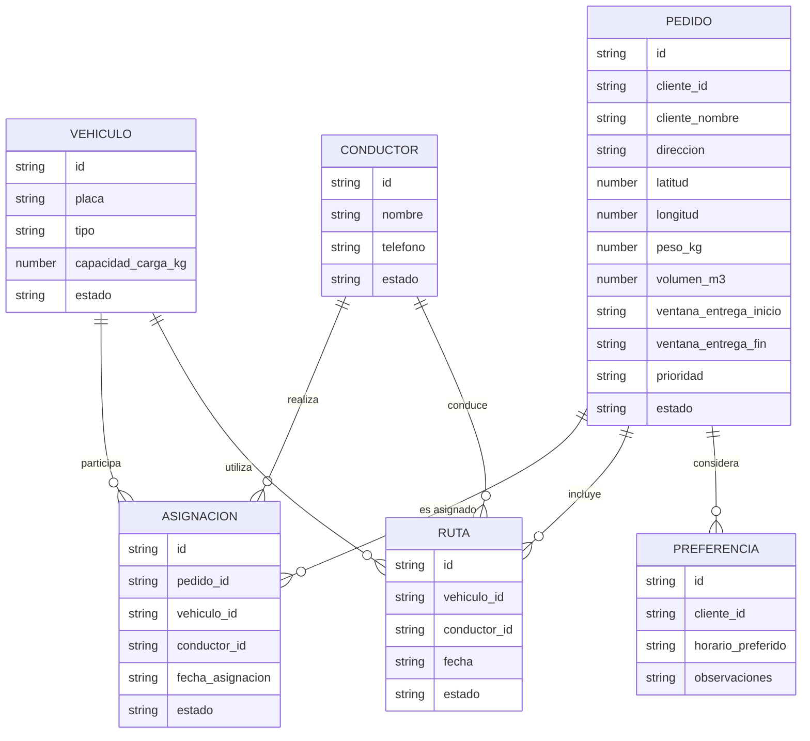

# EcoRuta Wanka

*Optimizador de rutas sostenibles de última milla — Huancayo, Junín*

# 11. Base de datos

**Versión:** V_1_0_0 | **Fecha:** 04/09/2026 | **Organización:** WankaLogística S.A.C. | **Ubicación:** Huancayo, Junín, Perú | **Repositorio:** github.com/DayanaJC/EcoRuta-Wanka

**Integrantes:** Arroyo Canchari Henry, Javier Curi Dayana

---

## 1. Objetivo del documento

Este documento describe el modelo de datos utilizado por EcoRuta Wanka.

El sistema utiliza **Firebase Cloud Firestore**, una base de datos NoSQL de tipo documental. El acceso a la información se realiza mediante el backend, utilizando el **Firebase Admin SDK**.

El modelo de datos se organiza en colecciones relacionadas con las principales operaciones del sistema:

* Vehículos.
* Pedidos.
* Asignaciones.
* Conductores.
* Rutas.
* Preferencias.

Las colecciones pueden ampliarse conforme se incorporen las funcionalidades definidas en los requisitos del proyecto.

---

## 2. Tecnología seleccionada

| Elemento              | Tecnología               | Uso                                       |
| --------------------- | ------------------------ | ----------------------------------------- |
| Tipo de base de datos | NoSQL documental         | Almacenamiento de información del sistema |
| Plataforma            | Firebase Cloud Firestore | Gestión de la base de datos               |
| Acceso                | Firebase Admin SDK       | Comunicación entre backend y Firestore    |
| Backend               | Python + FastAPI         | Procesamiento de información              |
| Identificadores       | ID único por documento   | Identificación de registros               |
| Comunicación          | API REST                 | Comunicación entre frontend y backend     |

La elección de Firestore permite utilizar una base de datos administrada en la nube y evita la necesidad de mantener directamente un servidor de base de datos.

---

## 3. Modelo conceptual

El modelo conceptual representa las principales entidades del sistema y sus relaciones.



### Relaciones principales

* Un vehículo puede participar en diferentes asignaciones.
* Un pedido puede ser asignado a un vehículo.
* Un conductor puede realizar diferentes asignaciones.
* Una ruta utiliza un vehículo y puede tener un conductor asignado.
* Una ruta puede incluir varios pedidos.
* Las preferencias permiten registrar condiciones relacionadas con la entrega.

---

## 4. Modelo lógico

### 4.1 Colección `vehiculos`

| Campo                        | Tipo        | Obligatorio | Descripción                             |
| ---------------------------- | ----------- | ----------- | --------------------------------------- |
| `id`                         | String      | Sí          | Identificador del vehículo              |
| `placa`                      | String      | Sí          | Placa del vehículo                      |
| `tipo`                       | String      | Sí          | Tipo de vehículo                        |
| `capacidad_carga_kg`         | Number      | Sí          | Capacidad máxima de carga               |
| `consumo_combustible_l100km` | Number      | Sí          | Consumo estimado de combustible         |
| `factor_emision_co2_kg_l`    | Number      | Sí          | Factor utilizado para estimar emisiones |
| `anio_fabricacion`           | Number      | Sí          | Año de fabricación                      |
| `estado`                     | String      | Sí          | Activo o inactivo                       |
| `created_at`                 | Date/String | Sí          | Fecha de creación                       |
| `updated_at`                 | Date/String | No          | Fecha de actualización                  |

---

### 4.2 Colección `pedidos`

| Campo                    | Tipo        | Obligatorio | Descripción                        |
| ------------------------ | ----------- | ----------- | ---------------------------------- |
| `id`                     | String      | Sí          | Identificador del pedido           |
| `cliente_id`             | String      | Sí          | Identificador del cliente          |
| `cliente_nombre`         | String      | Sí          | Nombre del cliente o bodega        |
| `direccion`              | String      | Sí          | Dirección de entrega               |
| `punto_referencia`       | String      | No          | Referencia para localizar el lugar |
| `latitud`                | Number      | Sí          | Latitud del punto de entrega       |
| `longitud`               | Number      | Sí          | Longitud del punto de entrega      |
| `peso_kg`                | Number      | Sí          | Peso del pedido                    |
| `volumen_m3`             | Number      | No          | Volumen del pedido                 |
| `ventana_entrega_inicio` | String      | No          | Inicio del horario de entrega      |
| `ventana_entrega_fin`    | String      | No          | Fin del horario de entrega         |
| `prioridad`              | String      | Sí          | Prioridad del pedido               |
| `tipo_producto`          | String      | Sí          | Tipo de producto                   |
| `estado`                 | String      | Sí          | Estado del pedido                  |
| `created_at`             | Date/String | Sí          | Fecha de creación                  |
| `updated_at`             | Date/String | No          | Fecha de actualización             |

---

### 4.3 Colección `asignaciones`

| Campo              | Tipo        | Obligatorio | Descripción                    |
| ------------------ | ----------- | ----------- | ------------------------------ |
| `id`               | String      | Sí          | Identificador de la asignación |
| `pedido_id`        | String      | Sí          | Pedido relacionado             |
| `vehiculo_id`      | String      | Sí          | Vehículo asignado              |
| `conductor_id`     | String      | No          | Conductor asignado             |
| `fecha_asignacion` | Date/String | Sí          | Fecha de la asignación         |
| `estado`           | String      | Sí          | Estado de la asignación        |
| `created_at`       | Date/String | Sí          | Fecha de creación              |
| `updated_at`       | Date/String | No          | Fecha de actualización         |

---

### 4.4 Colección `conductores`

| Campo        | Tipo        | Obligatorio | Descripción                 |
| ------------ | ----------- | ----------- | --------------------------- |
| `id`         | String      | Sí          | Identificador del conductor |
| `nombre`     | String      | Sí          | Nombre del conductor        |
| `telefono`   | String      | No          | Teléfono de contacto        |
| `estado`     | String      | Sí          | Estado del conductor        |
| `created_at` | Date/String | Sí          | Fecha de creación           |
| `updated_at` | Date/String | No          | Fecha de actualización      |

---

### 4.5 Colección `rutas`

| Campo                   | Tipo        | Obligatorio | Descripción                  |
| ----------------------- | ----------- | ----------- | ---------------------------- |
| `id`                    | String      | Sí          | Identificador de la ruta     |
| `vehiculo_id`           | String      | Sí          | Vehículo utilizado           |
| `conductor_id`          | String      | No          | Conductor asignado           |
| `fecha`                 | Date/String | Sí          | Fecha de la ruta             |
| `pedidos`               | Array       | Sí          | Pedidos incluidos en la ruta |
| `distancia_estimada_km` | Number      | No          | Distancia estimada           |
| `tiempo_estimado`       | Number      | No          | Tiempo estimado              |
| `estado`                | String      | Sí          | Estado de la ruta            |
| `created_at`            | Date/String | Sí          | Fecha de creación            |
| `updated_at`            | Date/String | No          | Fecha de actualización       |

---

### 4.6 Colección `preferencias`

| Campo               | Tipo        | Obligatorio | Descripción                     |
| ------------------- | ----------- | ----------- | ------------------------------- |
| `id`                | String      | Sí          | Identificador de la preferencia |
| `cliente_id`        | String      | Sí          | Cliente o bodega relacionada    |
| `horario_preferido` | String      | No          | Horario preferido de entrega    |
| `observaciones`     | String      | No          | Indicaciones adicionales        |
| `created_at`        | Date/String | Sí          | Fecha de creación               |
| `updated_at`        | Date/String | No          | Fecha de actualización          |

---

## 5. Relaciones entre colecciones

Firestore no utiliza claves foráneas como una base de datos relacional. Las relaciones se manejan mediante identificadores de los documentos relacionados.

| Relación               | Identificador utilizado |
| ---------------------- | ----------------------- |
| Pedido → Cliente       | `cliente_id`            |
| Asignación → Pedido    | `pedido_id`             |
| Asignación → Vehículo  | `vehiculo_id`           |
| Asignación → Conductor | `conductor_id`          |
| Ruta → Vehículo        | `vehiculo_id`           |
| Ruta → Conductor       | `conductor_id`          |
| Preferencia → Cliente  | `cliente_id`            |

Esto permite mantener separadas las diferentes entidades y relacionarlas cuando el sistema necesita consultar información.

---

## 6. Normalización

Aunque Firestore es una base de datos NoSQL, el diseño considera principios de organización de datos para evitar duplicaciones innecesarias.

### Primera Forma Normal (1FN)

Los campos almacenan valores individuales y tienen un significado definido.

### Segunda Forma Normal (2FN)

Los datos se organizan de acuerdo con la entidad a la que pertenecen. Por ejemplo, la información del vehículo se almacena en `vehiculos` y la información del pedido en `pedidos`.

### Tercera Forma Normal (3FN)

Se evita almacenar información que pertenece a otra entidad cuando puede utilizarse una referencia mediante un identificador.

Por ejemplo:

```text
asignaciones
   |
   ├── pedido_id → pedidos
   ├── vehiculo_id → vehiculos
   └── conductor_id → conductores
```

---

## 7. Información utilizada para las rutas

Para generar una ruta, el sistema utiliza principalmente información de las siguientes colecciones:

```text
Vehículos
   ↓
capacidad + estado + características
   ↓
Pedidos
   ↓
ubicación + peso + prioridad + ventana de entrega
   ↓
Asignaciones
   ↓
pedidos asociados al vehículo
   ↓
Ruta
```

La información permite determinar qué pedidos pueden ser considerados para una ruta y qué vehículo puede atenderlos.

---

## 8. Información para indicadores de sostenibilidad

La colección `vehiculos` contiene información que puede utilizarse para estimar indicadores de sostenibilidad:

| Dato                         | Uso                                 |
| ---------------------------- | ----------------------------------- |
| `capacidad_carga_kg`         | Evaluar utilización de la capacidad |
| `consumo_combustible_l100km` | Estimar consumo                     |
| `factor_emision_co2_kg_l`    | Estimar emisiones de CO₂            |
| Distancia de la ruta         | Estimar recorrido                   |
| Tiempo de la ruta            | Analizar eficiencia de la operación |

Estos datos se relacionan con **RF-05 Indicadores de sostenibilidad** y **RF-06 Reportes de sostenibilidad**.

---

## 9. Seguridad de la información

La información almacenada debe protegerse mediante las siguientes medidas:

| Medida                  | Aplicación                                                                   |
| ----------------------- | ---------------------------------------------------------------------------- |
| Acceso mediante backend | Las operaciones con la base de datos pasan por los servicios del sistema.    |
| Credenciales protegidas | Las credenciales de Firebase no deben almacenarse en el repositorio público. |
| Variables de entorno    | La configuración sensible se mantiene fuera del código fuente.               |
| Control de acceso       | Las operaciones disponibles dependen del rol del usuario.                    |
| Validación de datos     | El backend valida la información antes de almacenarla.                       |
| Copias y disponibilidad | Firestore administra la infraestructura de almacenamiento.                   |

---

## 10. Trazabilidad con los requisitos

| Requisito / regla                                     | Información relacionada                            |
| ----------------------------------------------------- | -------------------------------------------------- |
| RF-01 – Gestión de flota vehicular                    | Colección `vehiculos`                              |
| RF-02 – Gestión de pedidos de reparto                 | Colección `pedidos`                                |
| RF-03 – Generación de rutas optimizadas por vehículo  | `vehiculos`, `pedidos`, `asignaciones`, `rutas`    |
| RF-04 – Visualización y seguimiento de rutas          | Colección `rutas`                                  |
| RF-05 – Indicadores de sostenibilidad                 | `vehiculos` y datos de rutas                       |
| RF-06 – Reportes de sostenibilidad                    | Indicadores almacenados y calculados               |
| RF-07 – Re-optimización de rutas                      | Información de `rutas`, `pedidos` y `asignaciones` |
| RF-08 – Gestión de conductores y asignación de rutas  | `conductores`, `asignaciones`, `rutas`             |
| RF-09 – Gestión de preferencias de clientes y bodegas | `preferencias`, `pedidos`                          |
| RF-10 – Autenticación y control por roles             | Usuarios y permisos del sistema                    |

---

## 11. Trazabilidad con las reglas de negocio

| Regla                                     | Información utilizada                                    |
| ----------------------------------------- | -------------------------------------------------------- |
| RN-002 – Capacidad del vehículo           | `vehiculos.capacidad_carga_kg` y `pedidos.peso_kg`       |
| RN-003 – Datos válidos para generar rutas | `pedidos.latitud` y `pedidos.longitud`                   |
| RN-004 – Vehículos disponibles            | `vehiculos.estado`                                       |
| RN-005 – Asignación de pedidos            | `asignaciones.pedido_id`                                 |
| RN-006 – Ventana horaria                  | `pedidos.ventana_entrega_inicio` y `ventana_entrega_fin` |
| RN-007 – Generación de rutas              | `vehiculos`, `pedidos` y `asignaciones`                  |
| RN-008 – Re-optimización                  | Información de `rutas` y `asignaciones`                  |
| RN-009 – Asignación de conductores        | `conductores` y `asignaciones`                           |
| RN-010 – Preferencias de entrega          | `preferencias`                                           |
| RN-011 – Indicadores de sostenibilidad    | Información de vehículos y rutas                         |
| RN-012 – Control de acceso                | Usuarios y roles                                         |

---

## 12. Ejemplo de documento

Ejemplo simplificado de un documento de la colección `vehiculos`:

```json
{
  "id": "vehiculo-001",
  "placa": "ABC-123",
  "tipo": "camioneta",
  "capacidad_carga_kg": 3500,
  "consumo_combustible_l100km": 12,
  "factor_emision_co2_kg_l": 2.31,
  "anio_fabricacion": 2020,
  "estado": "activo"
}
```

Ejemplo de un documento de la colección `pedidos`:

```json
{
  "id": "pedido-001",
  "cliente_id": "CLI-001",
  "cliente_nombre": "Comercial Huancayo",
  "direccion": "Huancayo",
  "latitud": -12.065,
  "longitud": -75.205,
  "peso_kg": 120,
  "prioridad": "estandar",
  "estado": "pendiente"
}
```

---

## 13. Conclusión

EcoRuta Wanka utilizará **Firebase Cloud Firestore** como base de datos NoSQL documental.

El modelo organiza la información principal del sistema en colecciones relacionadas con vehículos, pedidos, asignaciones, conductores, rutas y preferencias.

El uso de identificadores permite relacionar los documentos sin depender de claves foráneas propias de las bases de datos relacionales. Además, la organización de la información permite aplicar las reglas de negocio y soportar las funcionalidades definidas en los requisitos funcionales.

El modelo de datos se integra con la **Arquitectura por Capas**, donde el backend administra el acceso a los datos y la lógica de negocio, mientras que el frontend interactúa con el sistema mediante los servicios disponibles.
