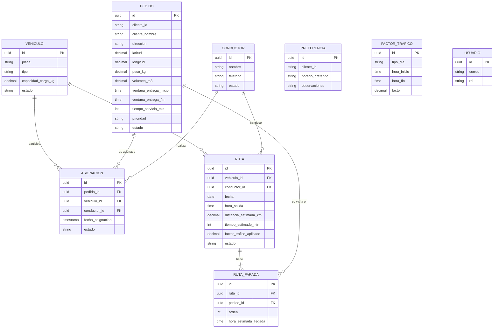

# EcoRuta Wanka

*Optimizador de rutas sostenibles de última milla — Huancayo, Junín*

# 11. Base de datos

**Versión:** V_1_1_0 | **Fecha:** 27/09/2026 | **Versión anterior:** V_1_0_0 (04/09/2026) – cambio CC-01 | **Organización:** WankaLogística S.A.C. | **Ubicación:** Huancayo, Junín, Perú | **Repositorio:** github.com/DayanaJC/EcoRuta-Wanka

**Integrantes:** Arroyo Canchari Henry, Javier Curi Dayana

---

## 1. Objetivo del documento

Este documento describe el modelo de datos utilizado por EcoRuta Wanka.

El sistema utiliza **Neon**, un servicio administrado de **PostgreSQL** (base de datos relacional). El acceso a la información se realiza únicamente desde el backend, mediante **Prisma ORM**.

> **Control de cambios (CC-01):** el modelo se diseñó inicialmente para Firebase Cloud Firestore (colecciones de documentos). Se migra a un modelo relacional porque las entidades del sistema están relacionadas entre sí y el diseño ya seguía los principios de normalización.

El modelo de datos se organiza en tablas relacionadas con las principales operaciones del sistema:

* Vehículos.
* Pedidos.
* Asignaciones.
* Conductores.
* Rutas y paradas de cada ruta.
* Preferencias.
* Factores de tráfico.
* Usuarios.

Las tablas pueden ampliarse conforme se incorporen las funcionalidades definidas en los requisitos del proyecto.

---

## 2. Tecnología seleccionada

| Elemento              | Tecnología                     | Uso                                                |
| --------------------- | ------------------------------ | -------------------------------------------------- |
| Tipo de base de datos | Relacional (SQL)               | Almacenamiento de información del sistema          |
| Motor                 | PostgreSQL                     | Gestión de tablas, relaciones y transacciones      |
| Plataforma            | Neon (PostgreSQL serverless)   | Base de datos administrada en la nube              |
| Acceso                | Prisma ORM                     | Comunicación entre backend y base de datos, migraciones |
| Backend               | Node.js + Express              | Procesamiento de información                       |
| Identificadores       | UUID por registro              | Identificación de registros                        |
| Comunicación          | API REST                       | Comunicación entre frontend y backend              |

La elección de Neon permite utilizar una base de datos administrada en la nube, con plan gratuito, y evita la necesidad de mantener directamente un servidor de base de datos. Además, permite crear **ramas** de la base de datos para separar los datos de desarrollo y de pruebas.

---

## 3. Modelo conceptual

El modelo conceptual representa las principales entidades del sistema y sus relaciones.



### Relaciones principales

* Un vehículo puede participar en diferentes asignaciones y rutas.
* Un pedido puede ser asignado a un vehículo.
* Un conductor puede realizar diferentes asignaciones y rutas.
* Una ruta utiliza un vehículo y puede tener un conductor asignado.
* Una ruta tiene varias **paradas**; cada parada corresponde a un pedido y guarda su **orden de visita** calculado por la optimización.
* Las preferencias permiten registrar condiciones de entrega de cada cliente.
* Los factores de tráfico ajustan los tiempos estimados según la franja horaria de salida.

---

## 4. Modelo lógico

Todas las tablas incluyen `created_at` (obligatorio, `TIMESTAMPTZ`, valor por defecto la fecha actual) y `updated_at` (opcional, `TIMESTAMPTZ`). Los estados y tipos se validan con restricciones `CHECK` o tipos enumerados de PostgreSQL.

### 4.1 Tabla `vehiculos`

| Campo                        | Tipo          | Obligatorio | Restricción                                 | Descripción                             |
| ---------------------------- | ------------- | ----------- | ------------------------------------------- | --------------------------------------- |
| `id`                         | UUID          | Sí          | PK                                          | Identificador del vehículo              |
| `placa`                      | VARCHAR(7)    | Sí          | UNIQUE, formato `ABC-123`                   | Placa del vehículo                      |
| `tipo`                       | VARCHAR(20)   | Sí          | `camioneta`, `furgon`, `moto`               | Tipo de vehículo                        |
| `capacidad_carga_kg`         | NUMERIC(8,2)  | Sí          | > 0                                         | Capacidad máxima de carga               |
| `consumo_combustible_l100km` | NUMERIC(5,2)  | Sí          | > 0                                         | Consumo estimado de combustible         |
| `factor_emision_co2_kg_l`    | NUMERIC(5,3)  | Sí          | > 0                                         | Factor utilizado para estimar emisiones |
| `anio_fabricacion`           | SMALLINT      | Sí          |                                             | Año de fabricación                      |
| `estado`                     | VARCHAR(10)   | Sí          | `activo`, `inactivo`                        | Estado operativo                        |

---

### 4.2 Tabla `pedidos`

| Campo                    | Tipo           | Obligatorio | Restricción                                  | Descripción                                   |
| ------------------------ | -------------- | ----------- | -------------------------------------------- | --------------------------------------------- |
| `id`                     | UUID           | Sí          | PK                                           | Identificador del pedido                      |
| `cliente_id`             | VARCHAR(20)    | Sí          |                                              | Identificador del cliente                     |
| `cliente_nombre`         | VARCHAR(120)   | Sí          |                                              | Nombre del cliente o bodega                   |
| `direccion`              | VARCHAR(200)   | Sí          |                                              | Dirección de entrega                          |
| `punto_referencia`       | VARCHAR(200)   | No          |                                              | Referencia para localizar el lugar            |
| `latitud`                | NUMERIC(9,6)   | Sí          | entre -90 y 90                               | Latitud del punto de entrega                  |
| `longitud`               | NUMERIC(9,6)   | Sí          | entre -180 y 180                             | Longitud del punto de entrega                 |
| `peso_kg`                | NUMERIC(8,2)   | Sí          | > 0                                          | Peso del pedido                               |
| `volumen_m3`             | NUMERIC(6,3)   | No          | > 0                                          | Volumen del pedido                            |
| `ventana_entrega_inicio` | TIME           | No          |                                              | Inicio del horario de entrega                 |
| `ventana_entrega_fin`    | TIME           | No          | posterior al inicio                          | Fin del horario de entrega                    |
| `tiempo_servicio_min`    | SMALLINT       | Sí          | ≥ 0, por defecto 5                           | Minutos estimados para realizar la entrega    |
| `prioridad`              | VARCHAR(12)    | Sí          | `express`, `estandar`, `economico`           | Prioridad del pedido                          |
| `tipo_producto`          | VARCHAR(15)    | Sí          | `perecedero`, `no_perecedero`                | Tipo de producto                              |
| `estado`                 | VARCHAR(12)    | Sí          | `pendiente`, `en_ruta`, `entregado`, `cancelado` | Estado del pedido                         |

---

### 4.3 Tabla `asignaciones`

| Campo              | Tipo        | Obligatorio | Restricción                  | Descripción                    |
| ------------------ | ----------- | ----------- | ---------------------------- | ------------------------------ |
| `id`               | UUID        | Sí          | PK                           | Identificador de la asignación |
| `pedido_id`        | UUID        | Sí          | FK → `pedidos.id`            | Pedido relacionado             |
| `vehiculo_id`      | UUID        | Sí          | FK → `vehiculos.id`          | Vehículo asignado              |
| `conductor_id`     | UUID        | No          | FK → `conductores.id`        | Conductor asignado             |
| `fecha_asignacion` | TIMESTAMPTZ | Sí          |                              | Fecha de la asignación         |
| `estado`           | VARCHAR(10) | Sí          | `asignada`, `cancelada`      | Estado de la asignación        |

Un pedido solo puede tener una asignación con estado `asignada` a la vez (índice único parcial sobre `pedido_id` donde `estado = 'asignada'`).

---

### 4.4 Tabla `conductores`

| Campo      | Tipo         | Obligatorio | Restricción             | Descripción                 |
| ---------- | ------------ | ----------- | ----------------------- | --------------------------- |
| `id`       | UUID         | Sí          | PK                      | Identificador del conductor |
| `nombre`   | VARCHAR(120) | Sí          |                         | Nombre del conductor        |
| `telefono` | VARCHAR(15)  | No          |                         | Teléfono de contacto        |
| `estado`   | VARCHAR(10)  | Sí          | `activo`, `inactivo`    | Estado del conductor        |

---

### 4.5 Tabla `rutas`

| Campo                     | Tipo          | Obligatorio | Restricción                                        | Descripción                                          |
| ------------------------- | ------------- | ----------- | -------------------------------------------------- | ---------------------------------------------------- |
| `id`                      | UUID          | Sí          | PK                                                 | Identificador de la ruta                             |
| `vehiculo_id`             | UUID          | Sí          | FK → `vehiculos.id`                                | Vehículo utilizado                                   |
| `conductor_id`            | UUID          | No          | FK → `conductores.id`                              | Conductor asignado                                   |
| `fecha`                   | DATE          | Sí          |                                                    | Fecha de la ruta                                     |
| `hora_salida`             | TIME          | Sí          |                                                    | Hora de salida del almacén                           |
| `distancia_estimada_km`   | NUMERIC(7,2)  | No          |                                                    | Distancia estimada (API de optimización)             |
| `tiempo_estimado_min`     | INTEGER       | No          |                                                    | Tiempo estimado con el factor de tráfico aplicado    |
| `factor_trafico_aplicado` | NUMERIC(4,2)  | No          |                                                    | Factor de tráfico usado al optimizar                 |
| `geometria`               | JSONB         | No          |                                                    | Trazado de la ruta para mostrarlo en el mapa         |
| `estado`                  | VARCHAR(12)   | Sí          | `generada`, `en_reparto`, `completada`, `cancelada` | Estado de la ruta                                    |

---

### 4.6 Tabla `ruta_paradas`

Reemplaza el arreglo `pedidos` del modelo documental y guarda el **orden de visita** calculado.

| Campo                   | Tipo     | Obligatorio | Restricción                          | Descripción                                |
| ----------------------- | -------- | ----------- | ------------------------------------ | ------------------------------------------ |
| `id`                    | UUID     | Sí          | PK                                   | Identificador de la parada                 |
| `ruta_id`               | UUID     | Sí          | FK → `rutas.id` (eliminación en cascada) | Ruta a la que pertenece                |
| `pedido_id`             | UUID     | Sí          | FK → `pedidos.id`                    | Pedido que se entrega en la parada         |
| `orden`                 | SMALLINT | Sí          | UNIQUE (`ruta_id`, `orden`)          | Posición en la secuencia de visita         |
| `hora_estimada_llegada` | TIME     | No          |                                      | Hora estimada de llegada                   |

---

### 4.7 Tabla `preferencias`

| Campo               | Tipo         | Obligatorio | Descripción                     |
| ------------------- | ------------ | ----------- | ------------------------------- |
| `id`                | UUID         | Sí          | Identificador de la preferencia |
| `cliente_id`        | VARCHAR(20)  | Sí          | Cliente o bodega relacionada    |
| `horario_preferido` | VARCHAR(50)  | No          | Horario preferido de entrega    |
| `observaciones`     | TEXT         | No          | Indicaciones adicionales        |

---

### 4.8 Tabla `factores_trafico`

Almacena los factores configurables que ajustan los tiempos de la API de optimización, que no considera el tráfico en tiempo real.

| Campo         | Tipo         | Obligatorio | Restricción                  | Descripción                                                     |
| ------------- | ------------ | ----------- | ---------------------------- | --------------------------------------------------------------- |
| `id`          | UUID         | Sí          | PK                           | Identificador del factor                                        |
| `tipo_dia`    | VARCHAR(12)  | Sí          | `laborable`, `fin_semana`    | Tipo de día al que aplica                                       |
| `hora_inicio` | TIME         | Sí          |                              | Inicio de la franja horaria                                     |
| `hora_fin`    | TIME         | Sí          | posterior al inicio          | Fin de la franja horaria                                        |
| `factor`      | NUMERIC(4,2) | Sí          | entre 0.3 y 1.0              | Multiplicador de velocidad (1.0 = sin tráfico; 0.7 = 30 % más lento) |
| `descripcion` | VARCHAR(100) | No          |                              | Por ejemplo, "Hora punta mañana"                                |

---

### 4.9 Tabla `usuarios`

| Campo             | Tipo          | Obligatorio | Restricción                                              | Descripción                    |
| ----------------- | ------------- | ----------- | -------------------------------------------------------- | ------------------------------ |
| `id`              | UUID          | Sí          | PK                                                       | Identificador del usuario      |
| `correo`          | VARCHAR(120)  | Sí          | UNIQUE                                                   | Correo de acceso               |
| `hash_contrasena` | VARCHAR(100)  | Sí          |                                                          | Contraseña cifrada con bcrypt  |
| `rol`             | VARCHAR(15)   | Sí          | `administrador`, `operador`, `conductor`, `cliente`      | Rol del usuario                |
| `estado`          | VARCHAR(10)   | Sí          | `activo`, `inactivo`                                     | Estado del usuario             |

---

## 5. Relaciones entre tablas

Las relaciones se garantizan mediante **claves foráneas**, por lo que la base de datos impide, por ejemplo, registrar una asignación con un vehículo inexistente.

| Relación                 | Clave foránea                 |
| ------------------------ | ----------------------------- |
| Asignación → Pedido      | `asignaciones.pedido_id`      |
| Asignación → Vehículo    | `asignaciones.vehiculo_id`    |
| Asignación → Conductor   | `asignaciones.conductor_id`   |
| Ruta → Vehículo          | `rutas.vehiculo_id`           |
| Ruta → Conductor         | `rutas.conductor_id`          |
| Parada → Ruta            | `ruta_paradas.ruta_id`        |
| Parada → Pedido          | `ruta_paradas.pedido_id`      |

`pedidos.cliente_id` y `preferencias.cliente_id` identifican al cliente o bodega. Cuando se implemente la gestión de clientes, se convertirán en claves foráneas hacia una tabla `clientes`.

---

## 6. Normalización

El diseño aplica las formas normales para evitar duplicaciones y anomalías de actualización.

### Primera Forma Normal (1FN)

Cada campo almacena un único valor. Por ejemplo, los pedidos de una ruta ya no se guardan como un arreglo dentro de la ruta, sino como filas de la tabla `ruta_paradas`.

### Segunda Forma Normal (2FN)

Cada campo depende de la clave completa de su tabla. En `ruta_paradas`, el `orden` y la `hora_estimada_llegada` dependen de la combinación ruta–pedido, mientras que los datos del pedido permanecen en `pedidos`.

### Tercera Forma Normal (3FN)

No se almacena información que pertenece a otra entidad; se utiliza una clave foránea.

Por ejemplo:

```text
asignaciones
   |
   ├── pedido_id    → pedidos.id
   ├── vehiculo_id  → vehiculos.id
   └── conductor_id → conductores.id
```

---

## 7. Información utilizada para las rutas

Para generar una ruta, el sistema combina información de las tablas y la envía a la API de optimización:

```text
Vehículos (capacidad + estado + tipo)
   ↓
Pedidos (ubicación + peso + ventana de entrega + tiempo de servicio)
   ↓
Asignaciones (pedidos asociados al vehículo)
   ↓
Factores de tráfico (según la hora de salida)
   ↓
API de optimización de rutas
   ↓
Rutas + Ruta_paradas (orden de visita, distancia y tiempo estimado)
```

La generación de la ruta y la actualización del estado de sus pedidos se registran en una **transacción**, de modo que no quedan datos a medias si ocurre un error.

---

## 8. Información para indicadores de sostenibilidad

La tabla `vehiculos` y los datos de `rutas` permiten estimar indicadores de sostenibilidad:

| Dato                         | Uso                                 |
| ---------------------------- | ----------------------------------- |
| `capacidad_carga_kg`         | Evaluar utilización de la capacidad |
| `consumo_combustible_l100km` | Estimar consumo                     |
| `factor_emision_co2_kg_l`    | Estimar emisiones de CO₂            |
| `rutas.distancia_estimada_km` | Estimar recorrido                  |
| `rutas.tiempo_estimado_min`  | Analizar eficiencia de la operación |

Estos datos se relacionan con **RF-05 Indicadores de sostenibilidad** y **RF-06 Reportes de sostenibilidad**.

---

## 9. Seguridad de la información

| Medida                  | Aplicación                                                                                 |
| ----------------------- | ------------------------------------------------------------------------------------------ |
| Acceso mediante backend | Solo el backend se conecta a la base de datos; el frontend nunca recibe la cadena de conexión. |
| Credenciales protegidas | La cadena de conexión de Neon (`DATABASE_URL`) y la API key de rutas no se almacenan en el repositorio. |
| Variables de entorno    | La configuración sensible se mantiene fuera del código fuente.                             |
| Control de acceso       | Las operaciones disponibles dependen del rol del usuario (JWT).                            |
| Contraseñas             | Se almacenan cifradas con bcrypt, nunca en texto plano.                                    |
| Validación de datos     | El backend valida la información (Zod) y la base de datos aplica restricciones y claves foráneas. |
| Copias y disponibilidad | Neon administra la infraestructura y permite restaurar la base de datos a un punto anterior. |

---

## 10. Trazabilidad con los requisitos

| Requisito / regla                                     | Información relacionada                                   |
| ----------------------------------------------------- | --------------------------------------------------------- |
| RF-01 – Gestión de flota vehicular                    | Tabla `vehiculos`                                         |
| RF-02 – Gestión de pedidos de reparto                 | Tabla `pedidos`                                           |
| RF-03 – Generación de rutas optimizadas por vehículo  | `vehiculos`, `pedidos`, `asignaciones`, `factores_trafico`, `rutas`, `ruta_paradas` |
| RF-04 – Visualización y seguimiento de rutas          | `rutas` (geometría) y `ruta_paradas`                      |
| RF-05 – Indicadores de sostenibilidad                 | `vehiculos` y datos de `rutas`                            |
| RF-06 – Reportes de sostenibilidad                    | Indicadores calculados a partir de `rutas` y `vehiculos`  |
| RF-07 – Re-optimización de rutas                      | `rutas`, `ruta_paradas`, `pedidos` y `asignaciones`       |
| RF-08 – Gestión de conductores y asignación de rutas  | `conductores`, `asignaciones`, `rutas`                    |
| RF-09 – Gestión de preferencias de clientes y bodegas | `preferencias`, `pedidos`                                 |
| RF-10 – Autenticación y control por roles             | Tabla `usuarios`                                          |

---

## 11. Trazabilidad con las reglas de negocio

| Regla                                     | Información utilizada                                    |
| ----------------------------------------- | -------------------------------------------------------- |
| RN-002 – Capacidad del vehículo           | `vehiculos.capacidad_carga_kg` y `pedidos.peso_kg`       |
| RN-003 – Datos válidos para generar rutas | `pedidos.latitud` y `pedidos.longitud`                   |
| RN-004 – Vehículos disponibles            | `vehiculos.estado`                                       |
| RN-005 – Asignación de pedidos            | `asignaciones.pedido_id`                                 |
| RN-006 – Ventana horaria                  | `pedidos.ventana_entrega_inicio` y `ventana_entrega_fin` |
| RN-007 – Generación de rutas              | `vehiculos`, `pedidos`, `asignaciones`, `factores_trafico` |
| RN-008 – Re-optimización                  | `rutas`, `ruta_paradas` y `asignaciones`                 |
| RN-009 – Asignación de conductores        | `conductores` y `asignaciones`                           |
| RN-010 – Preferencias de entrega          | `preferencias`                                           |
| RN-011 – Indicadores de sostenibilidad    | Información de vehículos y rutas                         |
| RN-012 – Control de acceso                | `usuarios.rol`                                           |

---

## 12. Ejemplo de registros

Ejemplo de un registro de la tabla `vehiculos`:

```sql
INSERT INTO vehiculos (placa, tipo, capacidad_carga_kg, consumo_combustible_l100km,
                       factor_emision_co2_kg_l, anio_fabricacion, estado)
VALUES ('ABC-123', 'camioneta', 3500, 12, 2.31, 2020, 'activo');
```

Ejemplo de un registro de la tabla `pedidos`:

```sql
INSERT INTO pedidos (cliente_id, cliente_nombre, direccion, latitud, longitud,
                     peso_kg, prioridad, tipo_producto, estado)
VALUES ('CLI-001', 'Comercial Huancayo', 'Huancayo', -12.065, -75.205,
        120, 'estandar', 'no_perecedero', 'pendiente');
```

Ejemplo de consulta de una ruta con sus paradas en orden:

```sql
SELECT r.fecha, v.placa, rp.orden, p.cliente_nombre, rp.hora_estimada_llegada
FROM rutas r
JOIN vehiculos v     ON v.id = r.vehiculo_id
JOIN ruta_paradas rp ON rp.ruta_id = r.id
JOIN pedidos p       ON p.id = rp.pedido_id
WHERE r.id = $1
ORDER BY rp.orden;
```

---

## 13. Conclusión

EcoRuta Wanka utiliza **Neon (PostgreSQL)** como base de datos relacional.

El modelo organiza la información en tablas de vehículos, pedidos, asignaciones, conductores, rutas, paradas, preferencias, factores de tráfico y usuarios. Las **claves foráneas** garantizan la integridad de las relaciones y la **normalización** evita duplicaciones.

El modelo de datos se integra con la **arquitectura cliente-servidor** y el patrón **MVC con capa de servicios**: los repositorios del backend (Prisma) administran el acceso a los datos, los servicios aplican las reglas de negocio y el frontend interactúa con el sistema mediante la API REST.
