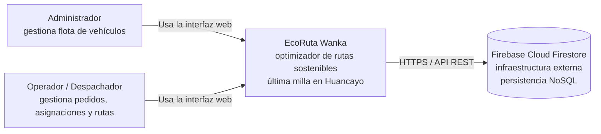
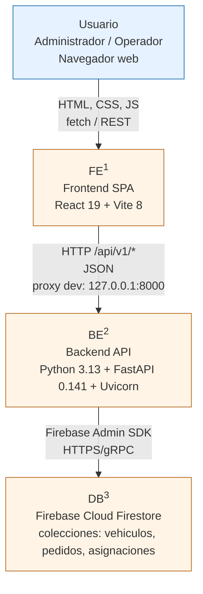
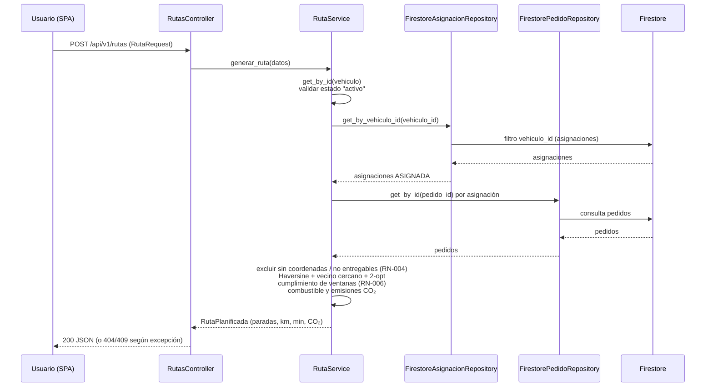

**PROYECTO FINAL DE CARRERA (PFA)**
**EcoRuta Wanka**
*Optimizador de rutas sostenibles de última milla — Huancayo, Junín*

# 12. Modelo C4

**Versión:** V_1_0_0 | **Fecha:** 04 de septiembre de 2026 | **Organización:** WankaLogística S.A.C. | **Ubicación:** Huancayo, Junín, Perú | **Repositorio:** github.com/DayanaJC/EcoRuta-Wanka

---

## 1. Objeto del documento

Documenta la arquitectura de EcoRuta Wanka con el **modelo C4** (Contexto, Contenedores, Componentes), representado en Mermaid. Los nombres de componentes reflejan **fielmente la estructura del repositorio** (`backend/app/` y `frontend/src/`).

**Mapa de niveles:**

| Nivel | Nombre | Alcance |
| --- | --- | --- |
| 1 | Contexto | El sistema y sus actores externos |
| 2 | Contenedores | Frontend, Backend y Firestore |
| 3 | Componentes | Arquitectura hexagonal del backend (paquetes reales) |

> No se desarrolla el Nivel 4 (código/clases) en este documento.

**Personas (actores) del nivel 1:** el **Administrador** (gestión de flota y catálogos) y el **Operador/Despachador** (gestión de pedidos, asignaciones y generación de rutas). Según el doc. 08, también se prevén el Conductor, el Cliente/Bodega y el Auditor Externo, pero **no cuentan con acceso implementado en la versión V_1_0_0** (sin autenticación aún).

---

## 2. Nivel 1 — Contexto del sistema



**Explicación:** EcoRuta Wanka es una aplicación web para la gestión de pedidos, vehículos y asignaciones, y el cálculo de rutas de reparto optimizadas (Haversine + vecino cercano + 2-opt) en la ciudad de Huancayo. Depende de **Firebase Cloud Firestore** como servicio externo de persistencia. El acceso se realiza únicamente por navegador.

---

## 3. Nivel 2 — Contenedores



**Descripción de contenedores:**

| Ref. | Contenedor | Responsabilidad | Tecnología |
| --- | --- | --- | --- |
| FE | Frontend SPA | Interfaz de gestión (vehículos, pedidos, asignaciones, rutas); consume la API por `fetch` | React 19, Vite 8, oxlint |
| BE | Backend API | Casos de uso, reglas de negocio, validación Pydantic y orquestación de la persistencia | FastAPI 0.141, Pydantic 2, Python 3.13 |
| DB | Cloud Firestore | Persistencia NoSQL de los datos operativos | Firebase Admin SDK 7.5 |

**Flujo típico:** el usuario opera la SPA → el frontend invoca los endpoints REST de `/api/v1/*` (proxy de Vite en desarrollo) → el backend valida y ejecuta el caso de uso en su capa de dominio → persiste/consulta Firestore → responde JSON → la SPA renderiza.

---

## 4. Nivel 3 — Componentes (arquitectura hexagonal del backend)

```mermaid
flowchart TB
    subgraph PRES["Capa presentación (adaptadores de entrada)"]
        CT[Controllers<br/>health, vehiculos, pedidos,<br/>asignaciones, rutas]
        DP[Dependencias<br/>get_db, get_vehiculo_service,<br/>get_pedido_service, get_asignacion_service, get_ruta_service]
    end

    subgraph SCH["Capa schemas (DTOs Pydantic)"]
        SC[Schemas<br/>VehiculoCreate/Response,<br/>PedidoCreate/Response,<br/>AsignacionCreate/Response,<br/>RutaRequest/RutaResponse]
    end

    subgraph BIZ["Capa negocio (núcleo de dominio)"]
        SV[Servicios<br/>VehiculoService, PedidoService,<br/>AsignacionService, RutaService]
        MD[Modelos de dominio<br/>Vehiculo, Pedido, Asignacion,<br/>RutaPlanificada, ParadaPlanificada<br/>y enums de estado/prioridad]
        EX[Excepciones de dominio<br/>VehiculoNotFoundError, PedidoNotFoundError,<br/>CapacidadInsuficienteError,<br/>PedidoYaAsignadoError, SinPedidosAsignadosError]
    end

    subgraph DATA["Capa datos (puertos y adaptadores)"]
        PT[Puertos<br/>VehiculoRepository, PedidoRepository,<br/>AsignacionRepository]
        AD[Adaptadores<br/>FirestoreVehiculoRepository,<br/>FirestorePedidoRepository,<br/>FirestoreAsignacionRepository]
    end

    subgraph CFG["Configuración"]
        SE[Settings<br/>python-dotenv<br/>FIREBASE_CREDENTIALS_PATH]
        FB[firebase.py<br/>initialize_firebase, get_firestore_client<br/>fail-fast]
    end

    U[Usuario (navegador)] -->|"HTTP REST JSON"| CT
    CT --> DP
    CT --> SCH
    DP -->|"inyección de dependencias"| SV
    SV --> MD
    SV --> EX
    SV -->|"usa puertos"| PT
    PT --> AD
    AD --> FB
    FB --> DB[(Firebase Cloud Firestore)]
    DB[ ]:::inv

    classDef core fill:#fde9e9,stroke:#b21f1f,stroke-width:1px
    class SV,MD,EX core
```

**Descripción de componentes:**

| Componente | Paquete (código real) | Responsabilidad |
| --- | --- | --- |
| Controllers | `backend/app/presentation/controllers/` | Endpoints REST (`GET /health`; `/api/v1/vehiculos`, `/pedidos`, `/asignaciones`; `POST /api/v1/rutas`) |
| Dependencias | `backend/app/presentation/dependencies/` | Contenedor simple de DI: `get_db`, `get_vehiculo_service`, `get_pedido_service`, `get_asignacion_service`, `get_ruta_service` |
| Schemas | `backend/app/schemas/` | Modelos Pydantic de entrada/salida (validación y serialización) |
| Servicios | `backend/app/business/services/` | Casos de uso: CRUD de flota/pedidos/asignaciones y cálculo de rutas con emisiones |
| Modelos de dominio | `backend/app/business/models/` | Entidades puras de dominio y enums |
| Excepciones | `backend/app/business/exceptions/` | Errores de dominio traducidos a respuestas HTTP `404`/`409`/`422` |
| Puertos | `backend/app/data/repositories/` | Contratos (interfaces ABC) de repositorio |
| Adaptadores | `backend/app/data/repositories/firebase/` | Implementaciones Firestore (constante `COLECCION`, cliente Admin SDK) |
| Configuración | `backend/app/config/settings.py`, `firebase.py` | Carga de `.env` y conexión Firestore con verificación de credenciales al arranque |

---

## 5. Flujo funcional de referencia (generación de ruta)

El endpoint `POST /api/v1/rutas` recibe un `RutaRequest` (id de vehículo y parámetros de estimación); `RutaService.generar_ruta()` traza las asignaciones activas del vehículo, excluye pedidos no ruteables (RN-004) y optimiza la secuencia con Haversine + vecino cercano + 2-opt.



---

## 6. Conclusión

La arquitectura de EcoRuta Wanka sigue el modelo C4 con una **arquitectura hexagonal limpia en el backend**: el núcleo de dominio (servicios, modelos, excepciones) es independiente del proveedor de datos y se conecta a Firestore mediante puertos y adaptadores. El frontend React consume únicamente la API REST, y la base de datos es un contenedor externo administrado. El nivel 3 documentado corresponde exactamente a los paquetes `presentation`, `business` y `data` del repositorio, lo que hace trazable el diseño con el código fuente actual.