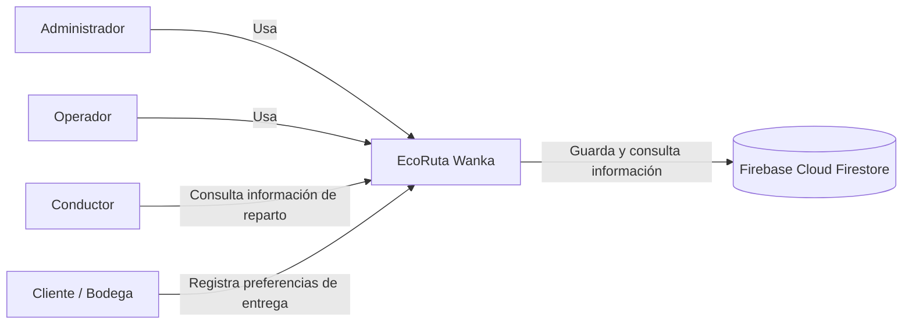
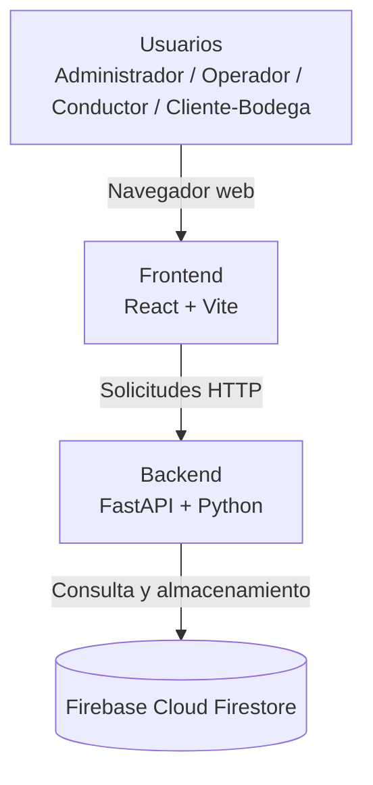
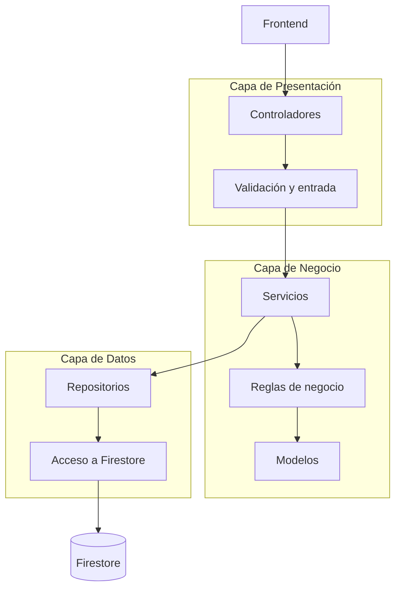
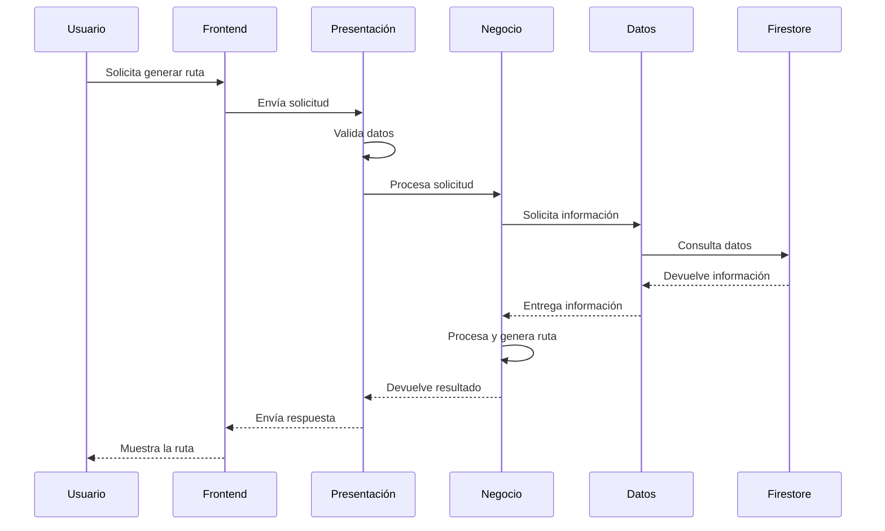

# EcoRuta Wanka

*Optimizador de rutas sostenibles de última milla — Huancayo, Junín*

# 12. Modelo C4

**Versión:** V_1_0_0 | **Fecha:** 04/09/2026 | **Organización:** WankaLogística S.A.C. | **Ubicación:** Huancayo, Junín, Perú | **Repositorio:** github.com/DayanaJC/EcoRuta-Wanka

**Integrantes:** Arroyo Canchari Henry, Javier Curi Dayana

---

## 1. Objeto del documento

Este documento representa la estructura de **EcoRuta Wanka** mediante el modelo C4, utilizando los niveles de **Contexto, Contenedores y Componentes**.

El proyecto utiliza **Arquitectura por Capas**, separando las responsabilidades principales del Backend en:

1. Capa de Presentación.
2. Capa de Negocio.
3. Capa de Datos.

### Niveles utilizados

| Nivel | Nombre       | ¿Qué muestra?                                    |
| ----- | ------------ | ------------------------------------------------ |
| 1     | Contexto     | El sistema y los usuarios que interactúan con él |
| 2     | Contenedores | Frontend, Backend y base de datos                |
| 3     | Componentes  | Las principales partes internas del Backend      |

---

## 2. Nivel 1 — Contexto del sistema



### ¿Qué es EcoRuta Wanka?

EcoRuta Wanka es una aplicación web orientada a la organización de las operaciones de reparto de **WankaLogística S.A.C.**

El sistema permite gestionar vehículos, pedidos, conductores, asignaciones y rutas, además de proporcionar información relacionada con la sostenibilidad de las operaciones.

### Usuarios principales

| Usuario              | Función principal                                                            |
| -------------------- | ---------------------------------------------------------------------------- |
| **Administrador**    | Gestiona usuarios, roles, vehículos y configuraciones generales del sistema. |
| **Operador**         | Gestiona pedidos, asignaciones y generación de rutas de reparto.             |
| **Conductor**        | Consulta las rutas y entregas que tiene asignadas.                           |
| **Cliente / Bodega** | Registra y consulta información relacionada con sus entregas y preferencias. |

### Sistema externo

**Firebase Cloud Firestore** se utiliza como servicio de almacenamiento de información del sistema.

---

## 3. Nivel 2 — Contenedores



### ¿Qué es cada contenedor?

| Contenedor    | Función                                                                                | Tecnología               |
| ------------- | -------------------------------------------------------------------------------------- | ------------------------ |
| **Frontend**  | Presenta las pantallas del sistema y permite a los usuarios realizar operaciones.      | React + Vite             |
| **Backend**   | Recibe las solicitudes, aplica las reglas de negocio y coordina el acceso a los datos. | Python + FastAPI         |
| **Firestore** | Almacena la información utilizada por el sistema.                                      | Firebase Cloud Firestore |

### Flujo general

El funcionamiento general es:

**Usuario → Frontend → Backend → Firestore**

El Backend procesa la solicitud y devuelve el resultado al Frontend:

**Firestore → Backend → Frontend → Usuario**

De esta manera, el usuario interactúa con la aplicación sin acceder directamente a la base de datos.

---

## 4. Nivel 3 — Componentes del Backend

El Backend utiliza **Arquitectura por Capas**. Cada capa tiene una responsabilidad diferente.



### 4.1 Capa de Presentación

Es la capa que recibe las solicitudes provenientes del Frontend.

Sus principales responsabilidades son:

* Recibir solicitudes HTTP.
* Validar los datos de entrada.
* Enviar la solicitud a la capa de negocio.
* Devolver la respuesta al Frontend.

Entre las operaciones principales se encuentran:

* Gestión de vehículos.
* Gestión de pedidos.
* Gestión de asignaciones.
* Generación de rutas.

---

### 4.2 Capa de Negocio

Es la capa donde se procesan las operaciones principales del sistema.

Sus responsabilidades son:

* Aplicar las reglas de negocio.
* Validar las condiciones necesarias para una operación.
* Gestionar vehículos, pedidos y asignaciones.
* Coordinar la generación y actualización de rutas.
* Procesar información relacionada con los indicadores de sostenibilidad.

Esta capa permite mantener separada la lógica del sistema de las pantallas y de la base de datos.

---

### 4.3 Capa de Datos

Es la capa encargada de comunicarse con la base de datos.

Sus responsabilidades son:

* Consultar información.
* Registrar información.
* Actualizar información.
* Eliminar información cuando corresponda.
* Mantener separado el acceso a Firestore de las reglas del negocio.

La comunicación con **Firebase Cloud Firestore** se realiza mediante los repositorios correspondientes.

---

## 5. Flujo principal de generación de una ruta

Uno de los procesos principales de EcoRuta Wanka es la generación de una ruta de reparto.

El flujo general es:

```text
Usuario
   ↓
Frontend
   ↓
Capa de Presentación
   ↓
Capa de Negocio
   ↓
Capa de Datos
   ↓
Firestore
```

Después de procesar la información, la respuesta sigue el camino contrario:

```text
Firestore
   ↓
Capa de Datos
   ↓
Capa de Negocio
   ↓
Capa de Presentación
   ↓
Frontend
   ↓
Usuario
```

### Proceso

1. El operador solicita la generación de una ruta desde el Frontend.
2. La capa de presentación recibe la solicitud y valida los datos.
3. La capa de negocio verifica las condiciones necesarias para generar la ruta.
4. La capa de datos consulta la información necesaria en Firestore.
5. La capa de negocio procesa la información y genera la propuesta de ruta.
6. El resultado es enviado nuevamente al Frontend.
7. El usuario puede visualizar la información de la ruta.

### Diagrama de secuencia



---

## 6. Relación entre C4 y la arquitectura por capas

La representación C4 permite visualizar el sistema desde diferentes niveles, mientras que la Arquitectura por Capas organiza principalmente el funcionamiento interno del Backend.

La relación es:

| Modelo C4        | Arquitectura del proyecto        |
| ---------------- | -------------------------------- |
| **Contexto**     | Usuarios y sistema EcoRuta Wanka |
| **Contenedores** | Frontend, Backend y Firestore    |
| **Componentes**  | Presentación, Negocio y Datos    |

Por lo tanto, C4 se utiliza para **representar la estructura del sistema**, mientras que la Arquitectura por Capas define **cómo se organizan las responsabilidades dentro del Backend**.

---

## 7. Conclusión

EcoRuta Wanka utiliza **Arquitectura por Capas** para organizar el Backend en Presentación, Negocio y Datos.

El modelo C4 permite representar esta estructura en tres niveles:

* **Contexto:** muestra los usuarios que interactúan con EcoRuta Wanka.
* **Contenedores:** muestra el Frontend, Backend y Firestore.
* **Componentes:** muestra las capas principales del Backend.

Esta organización permite separar responsabilidades, facilitar el mantenimiento y permitir que cada parte del sistema pueda evolucionar de manera ordenada.

### Arquitectura final

```text
Usuarios
   ↓
Frontend
   ↓
Capa de Presentación
   ↓
Capa de Negocio
   ↓
Capa de Datos
   ↓
Firebase Cloud Firestore
```
