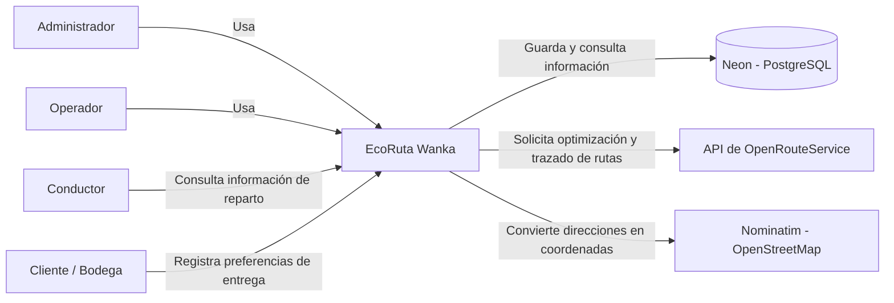
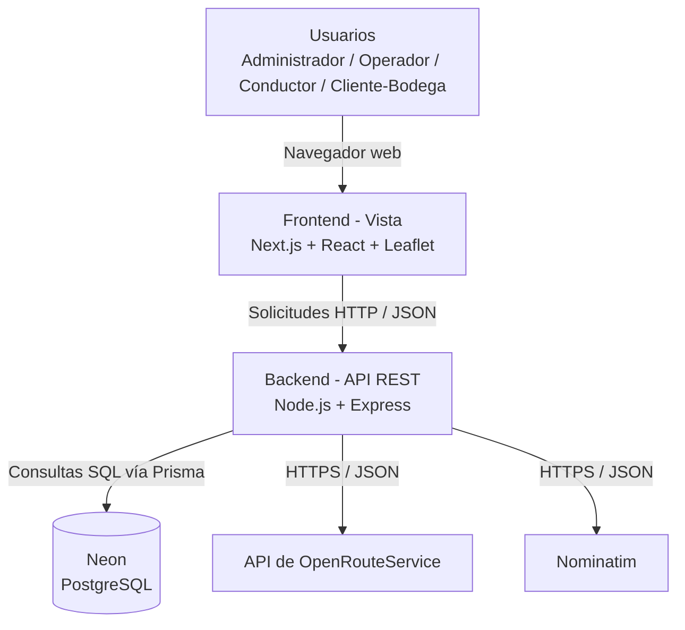
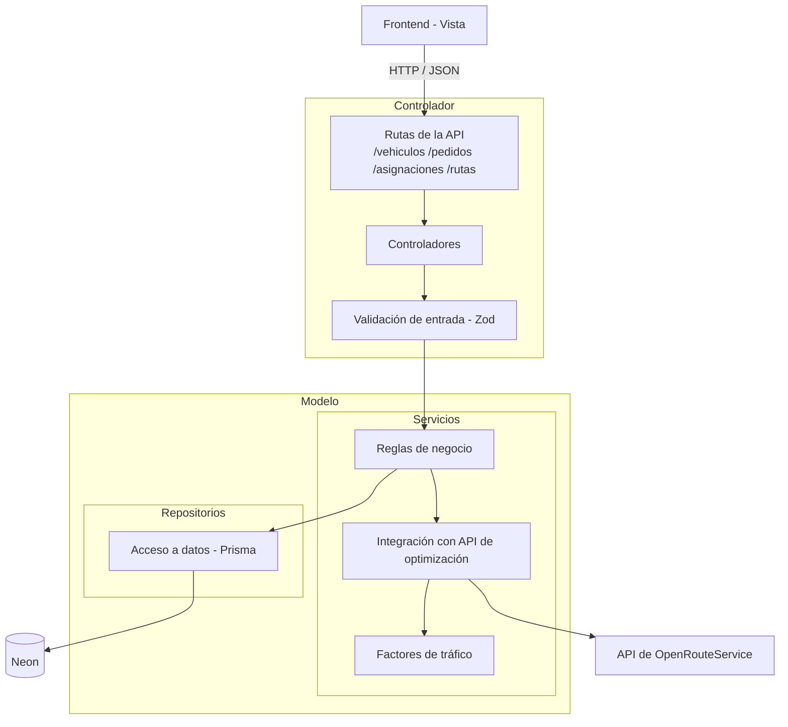
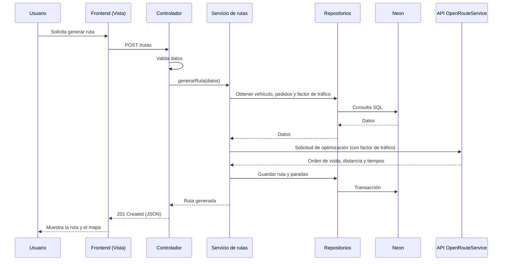

# EcoRuta Wanka

*Optimizador de rutas sostenibles de última milla — Huancayo, Junín*

# 12. Modelo C4

**Versión:** V_1_0_0 | **Fecha:** 04/09/2026 | **Organización:** WankaLogística S.A.C. | **Ubicación:** Huancayo, Junín, Perú | **Repositorio:** github.com/DayanaJC/EcoRuta-Wanka

**Integrantes:** Arroyo Canchari Henry, Javier Curi Dayana

---

## 1. Objeto del documento

Este documento representa la estructura de **EcoRuta Wanka** mediante el modelo C4, utilizando los niveles de **Contexto, Contenedores y Componentes**.

El proyecto utiliza una **arquitectura cliente-servidor**: el frontend (cliente) se comunica con el backend (servidor) mediante una **API REST**. Dentro del sistema se aplica el patrón **MVC con capa de servicios**:

1. **Vista:** pantallas del frontend.
2. **Controlador:** recibe las solicitudes de la API.
3. **Modelo:** servicios (reglas de negocio e integración con APIs externas) y repositorios (acceso a datos).

### Niveles utilizados

| Nivel | Nombre       | ¿Qué muestra?                                                   |
| ----- | ------------ | --------------------------------------------------------------- |
| 1     | Contexto     | El sistema, los usuarios y los sistemas externos                |
| 2     | Contenedores | Frontend, Backend, base de datos y servicios externos           |
| 3     | Componentes  | Las principales partes internas del Backend (MVC)               |

---

## 2. Nivel 1 — Contexto del sistema


```mermaid
flowchart LR

    A[Administrador] -->|Usa| S[EcoRuta Wanka]
    O[Operador] -->|Usa| S
    C[Conductor] -->|Consulta información de reparto| S
    B[Cliente / Bodega] -->|Registra preferencias de entrega| S

    S -->|Guarda y consulta información| DB[(Neon - PostgreSQL)]
    S -->|Solicita optimización y trazado de rutas| ORS[API de OpenRouteService]
    S -->|Convierte direcciones en coordenadas| NOM[Nominatim - OpenStreetMap]
```

### ¿Qué es EcoRuta Wanka?

EcoRuta Wanka es una aplicación web orientada a la organización de las operaciones de reparto de **WankaLogística S.A.C.**

El sistema permite gestionar vehículos, pedidos, conductores, asignaciones y rutas optimizadas, además de proporcionar información relacionada con la sostenibilidad de las operaciones.

### Usuarios principales

| Usuario              | Función principal                                                            |
| -------------------- | ---------------------------------------------------------------------------- |
| **Administrador**    | Gestiona usuarios, roles, vehículos y configuraciones generales del sistema. |
| **Operador**         | Gestiona pedidos, asignaciones y generación de rutas de reparto.             |
| **Conductor**        | Consulta las rutas y entregas que tiene asignadas.                           |
| **Cliente / Bodega** | Registra y consulta información relacionada con sus entregas y preferencias. |

### Sistemas externos

| Sistema                        | Uso                                                                                       |
| ------------------------------ | ----------------------------------------------------------------------------------------- |
| **Neon (PostgreSQL)**          | Almacenamiento de la información del sistema.                                             |
| **API de OpenRouteService**    | Optimización del orden de visita (motor VROOM) y trazado de rutas sobre calles reales.    |
| **Nominatim (OpenStreetMap)**  | Geocodificación de las direcciones de los pedidos.                                        |
| **OpenStreetMap**              | Mapa base mostrado en el frontend.                                                        |

---

## 3. Nivel 2 — Contenedores


```mermaid
flowchart TB

    U[Usuarios<br/>Administrador / Operador / Conductor / Cliente-Bodega]

    FE[Frontend - Vista<br/>Next.js + React + Leaflet]

    BE[Backend - API REST<br/>Node.js + Express]

    DB[(Neon<br/>PostgreSQL)]

    ORS[API de OpenRouteService]
    NOM[Nominatim]

    U -->|Navegador web| FE
    FE -->|Solicitudes HTTP / JSON| BE
    BE -->|Consultas SQL vía Prisma| DB
    BE -->|HTTPS / JSON| ORS
    BE -->|HTTPS / JSON| NOM
```

### ¿Qué es cada contenedor?

| Contenedor      | Función                                                                                                    | Tecnología                   |
| --------------- | ---------------------------------------------------------------------------------------------------------- | ---------------------------- |
| **Frontend**    | Presenta las pantallas y el mapa, y permite a los usuarios realizar operaciones (Vista).                   | Next.js + React + Leaflet    |
| **Backend**     | Expone la API REST, aplica las reglas de negocio, llama a los servicios externos y accede a los datos.     | Node.js + Express            |
| **Base de datos** | Almacena la información utilizada por el sistema.                                                        | Neon (PostgreSQL)            |

### Flujo general

El funcionamiento general es:

**Usuario → Frontend → API REST (Backend) → Neon / APIs externas**

El Backend procesa la solicitud y devuelve el resultado al Frontend:

**Neon / APIs externas → Backend → Frontend → Usuario**

De esta manera, el usuario interactúa con la aplicación sin acceder directamente a la base de datos ni a las APIs externas. Las credenciales (cadena de conexión y API key) permanecen solo en el servidor.

---

## 4. Nivel 3 — Componentes del Backend (MVC)

El Backend aplica el patrón **MVC con capa de servicios**. La Vista corresponde al Frontend; dentro del Backend se encuentran el Controlador y el Modelo.


```mermaid
flowchart TB

    F[Frontend - Vista]

    subgraph C["Controlador"]
        C1[Rutas de la API<br/>/vehiculos /pedidos /asignaciones /rutas]
        C2[Controladores]
        C3[Validación de entrada - Zod]
    end

    subgraph M["Modelo"]
        subgraph S["Servicios"]
            S1[Reglas de negocio]
            S2[Integración con API de optimización]
            S3[Factores de tráfico]
        end
        subgraph R["Repositorios"]
            R1[Acceso a datos - Prisma]
        end
    end

    DB[(Neon)]
    ORS[API de OpenRouteService]

    F -->|HTTP / JSON| C1
    C1 --> C2
    C2 --> C3
    C3 --> S1
    S1 --> R1
    S1 --> S2
    S2 --> S3
    S2 --> ORS
    R1 --> DB
```

### 4.1 Controlador

Recibe las solicitudes provenientes del Frontend a través de los endpoints de la API.

Sus principales responsabilidades son:

* Definir los endpoints de la API REST.
* Validar los datos de entrada.
* Enviar la solicitud al servicio correspondiente.
* Devolver la respuesta en formato JSON con el código HTTP adecuado.

Entre los endpoints principales se encuentran:

| Recurso          | Operaciones principales                                         |
| ---------------- | --------------------------------------------------------------- |
| `/vehiculos`     | Registrar, listar, obtener, actualizar, cambiar estado          |
| `/pedidos`       | Registrar, listar, obtener, actualizar, cambiar estado, cancelar |
| `/asignaciones`  | Asignar pedido a vehículo, listar, cancelar                     |
| `/rutas`         | Generar ruta optimizada, listar, obtener, cambiar estado        |

---

### 4.2 Modelo — Servicios

Es la parte donde se procesan las operaciones principales del sistema.

Sus responsabilidades son:

* Aplicar las reglas de negocio (capacidad, vehículos activos, ventanas de entrega).
* Validar las condiciones necesarias para una operación.
* Gestionar vehículos, pedidos y asignaciones.
* Preparar la solicitud a la API de optimización y aplicar los factores de tráfico.
* Interpretar la respuesta de la API y construir la ruta con el orden de visita.
* Procesar información relacionada con los indicadores de sostenibilidad.

Los servicios mantienen la lógica del sistema separada de las pantallas, de la base de datos y de los detalles de cada API externa.

---

### 4.3 Modelo — Repositorios

Son los componentes encargados de comunicarse con la base de datos.

Sus responsabilidades son:

* Consultar información.
* Registrar información.
* Actualizar información.
* Eliminar información cuando corresponda.
* Mantener separado el acceso a Neon de las reglas del negocio.

La comunicación con **Neon (PostgreSQL)** se realiza mediante **Prisma ORM**.

---

## 5. Flujo principal de generación de una ruta

Uno de los procesos principales de EcoRuta Wanka es la generación de una ruta de reparto optimizada.

```text
Usuario
   ↓
Frontend (Vista)
   ↓  POST /rutas
Controlador
   ↓
Servicio de rutas ──► Repositorios ──► Neon (pedidos, vehículo, factores de tráfico)
   ↓
API de OpenRouteService (orden óptimo + trazado)
   ↓
Servicio de rutas (aplica resultado)
   ↓
Repositorios ──► Neon (guarda ruta y paradas)
   ↓
Controlador ──► Frontend ──► Usuario (lista y mapa)
```

### Proceso

1. El operador solicita la generación de una ruta desde el Frontend.
2. El Controlador recibe la solicitud y valida los datos.
3. El servicio verifica las condiciones necesarias (vehículo activo, pedidos con coordenadas válidas, capacidad).
4. Los repositorios consultan los pedidos, el vehículo y el factor de tráfico de la franja horaria de salida.
5. El servicio envía los datos a la API de optimización con el factor de tráfico aplicado.
6. El servicio interpreta la respuesta y los repositorios guardan la ruta y sus paradas en una transacción.
7. El resultado es enviado al Frontend, que muestra la secuencia de entregas y el mapa.

### Diagrama de secuencia


```mermaid
sequenceDiagram

    participant U as Usuario
    participant F as Frontend (Vista)
    participant C as Controlador
    participant S as Servicio de rutas
    participant R as Repositorios
    participant DB as Neon
    participant O as API OpenRouteService

    U->>F: Solicita generar ruta
    F->>C: POST /rutas
    C->>C: Valida datos
    C->>S: generarRuta(datos)
    S->>R: Obtener vehículo, pedidos y factor de tráfico
    R->>DB: Consulta SQL
    DB-->>R: Datos
    R-->>S: Datos
    S->>O: Solicitud de optimización (con factor de tráfico)
    O-->>S: Orden de visita, distancia y tiempos
    S->>R: Guardar ruta y paradas
    R->>DB: Transacción
    S-->>C: Ruta generada
    C-->>F: 201 Created (JSON)
    F-->>U: Muestra la ruta y el mapa
```

---

## 6. Relación entre C4 y la arquitectura del proyecto

La representación C4 permite visualizar el sistema desde diferentes niveles, mientras que la arquitectura cliente-servidor y el patrón MVC definen cómo se reparten y organizan las responsabilidades.

| Modelo C4        | Arquitectura del proyecto                                              |
| ---------------- | ---------------------------------------------------------------------- |
| **Contexto**     | Usuarios, sistema EcoRuta Wanka y sistemas externos                    |
| **Contenedores** | Cliente (Frontend) y servidor (Backend), Neon y APIs externas          |
| **Componentes**  | Controlador y Modelo (servicios y repositorios) del patrón MVC         |

Por lo tanto, C4 se utiliza para **representar la estructura del sistema**, la arquitectura cliente-servidor define **cómo se comunican el frontend y el backend** y el patrón MVC define **cómo se organizan las responsabilidades dentro de la aplicación**.

---

## 7. Conclusión

EcoRuta Wanka utiliza una **arquitectura cliente-servidor** con comunicación mediante **API REST** y aplica el patrón **MVC con capa de servicios**.

El modelo C4 permite representar esta estructura en tres niveles:

* **Contexto:** muestra los usuarios y los sistemas externos (Neon, OpenRouteService y Nominatim).
* **Contenedores:** muestra el Frontend (Next.js), el Backend (Node.js + Express) y la base de datos.
* **Componentes:** muestra el Controlador y el Modelo del Backend.

Esta organización permite separar responsabilidades, facilitar el mantenimiento y permitir que cada parte del sistema evolucione de manera ordenada.

### Arquitectura final

```text
CLIENTE                                  SERVIDOR
Usuarios                                 Controlador (Express)
   ↓                                        ↓
Vista (Next.js) ── API REST (JSON) ──►   Modelo: Servicios ──► API de OpenRouteService
                                            ↓
                                         Modelo: Repositorios (Prisma)
                                            ↓
                                         Neon (PostgreSQL)
```

[Volver al README principal](../../README.md)
